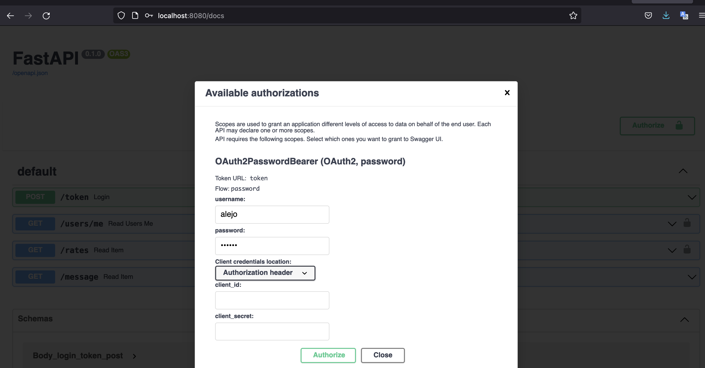

# API RATES
---
```
▕┈▔╲▍┈▋┈▍┈▋╱▔┈▏┈
ALEJANDRO CORDOBA
▕┈▔╲▍┈▋┈▍┈▋╱▔┈▏┈

```

### Rate exchange collector (Demo)

This repository contains code for a rate exchange collector, 
a set of jobs aimed to collect the rates per day .

###ENVIROMENT SETUP

there are two ways:

1. Build and Run docker ->

The you can put a diferent image name instead <alejoartia/currency:v.0.0.1>
replace with <name>:<tag>

$ docker build -t alejoartia/currency:v.0.0.1 -f Dockerfile .  
$ docker run -d --name currency -p 8080:8080 alejoartia/currency:v.0.0.1

2. the second option is just run ->

$ docker-compose.yml


3. in case you have trouble do this and run docker again (2 or 3):

$ docker rm -vf $(docker ps -aq) 
$ docker rmi -f $(docker images -aq)  


4. to run the just the test file with docker ->

$ docker exec -it currency pytest app/test_main.py 


# JOBS

---
`banxico_api.py` - Collects banxico data from last rate update 

`federation_scrap.py` - Scrap federation data

`fixer_api.py` - Collects banxico data from the fixer api 

redis is installed to manage the ratelimits 

# ENDPOINTS

-the API is documented by swagger, just need to be accesed by 

http://localhost:8080/docs

-once you access there it's necessary in login due to you need access with a token:
you can use:

username : alejo
password : secret



/token will provide the bearer token the you can access by the headers with the autho.
# PROJECT STRUCTURE

---
```
├── Dockerfile
├── README.md
├── app
│   ├── __init__.py
│   ├── config.py
│   ├── main.py
│   └── redis.py
│   └── test_main.py
│   ├── src
│   │   ├── banxico_api.py
│   │   ├── federacion_scrap.py
│   │   ├── fixer_api.py
├── .gitignore
├── docker-compose.yaml
├── Dockerfile
├── README.md
├── requirements.txt
├── start.sh
├── testing-pod.yaml

```
---
by #Alejandro Cordoba 2022
